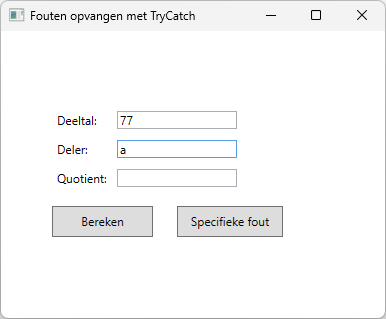
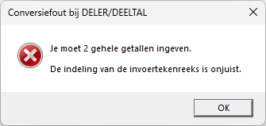
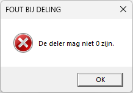
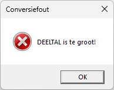

# Oefening 3: DelenTryCatch

In dit voorbeeld wordt getoond hoe "onverwachte" fouten opgevangen
kunnen worden.

Het scherm bevat:

-   De tekstvakken *dividentTextBox, sharerTextBox* en
    *resultTextBox*.

-   De opdrachtknop *calculateButton*. Bij het klikken op deze knop
    wordt de waarde uit *dividentTextBox* door *sharerTextBox* gedeeld
    en het resultaat getoond in *resultTextBox*. Als er fouten optreden,
    dan verschijnt een gepaste melding zoals in volgende
    schermvoorbeelden wordt getoond. Vang de fouten zo specifiek
    mogelijk op!

